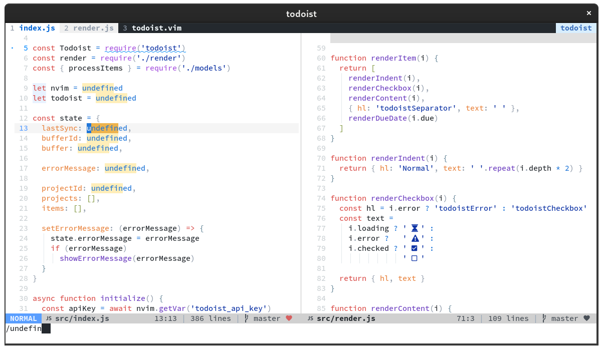
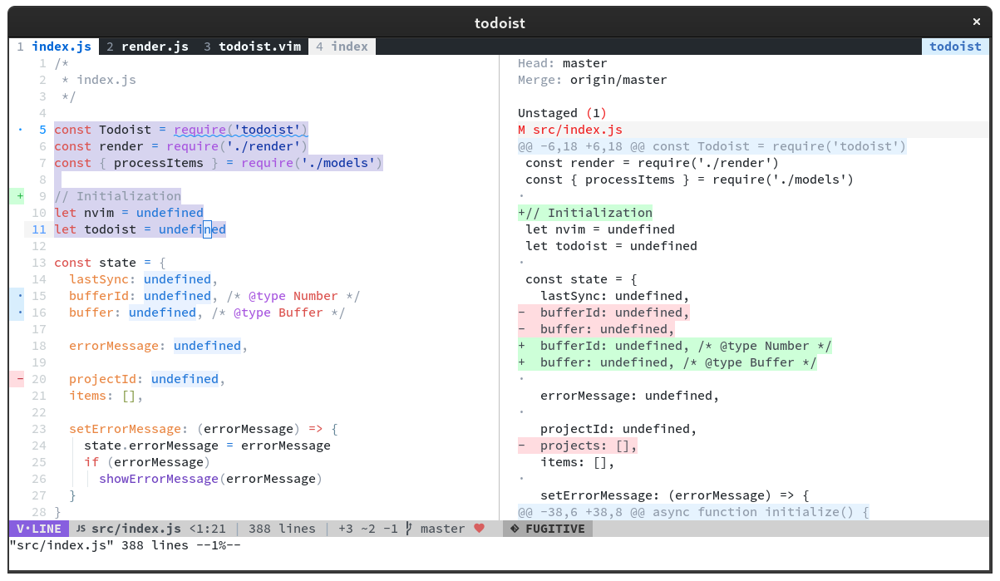
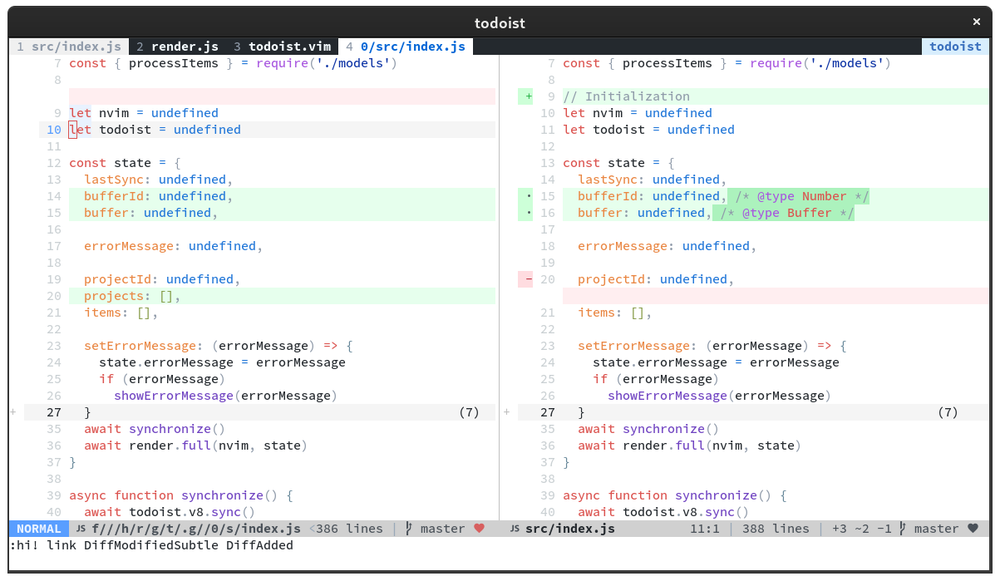
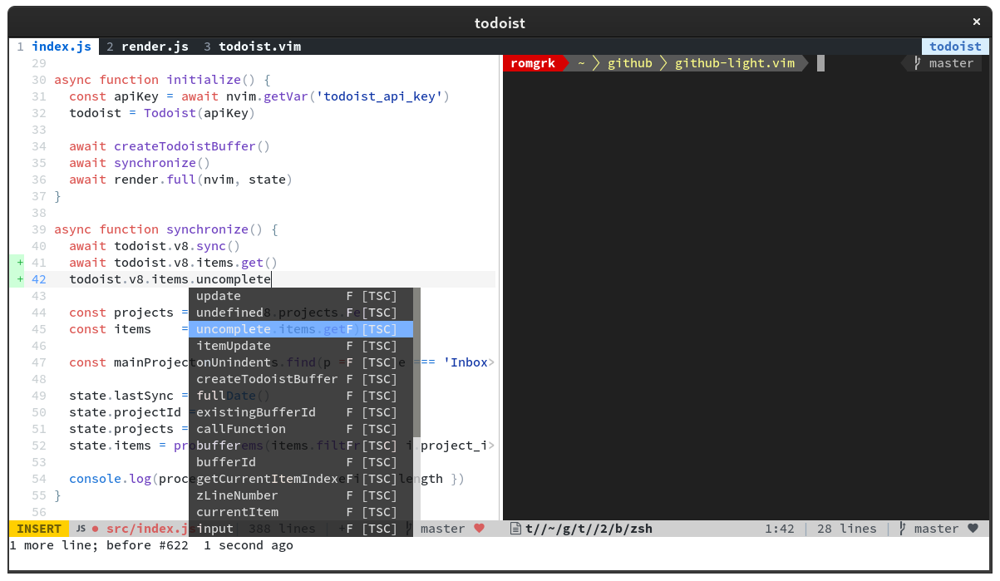

# github-light.vim

> Don't join the Dark Side!

All other github colorschemes fail to capture the real github theme. This one
comes as close as I could take it.

## Install

```vim
Plug 'romgrk/github-light.vim'
```

## Screenshots

Theme



Fugitive diff mode & Visual selection



Side-by-side diff



Terminal & Completion popup


